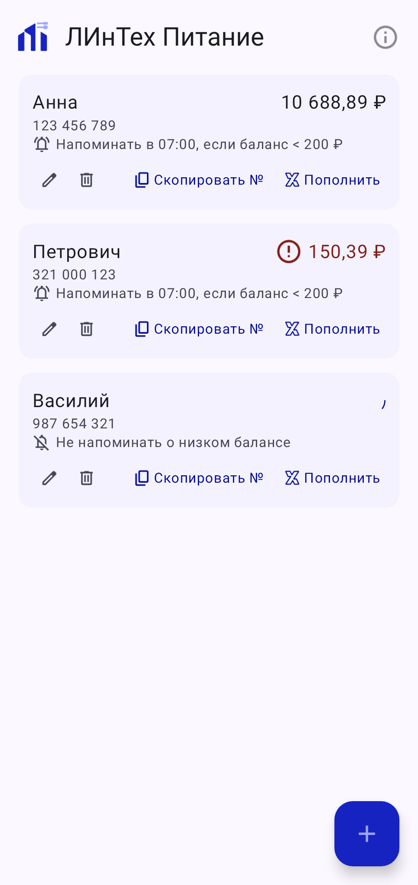
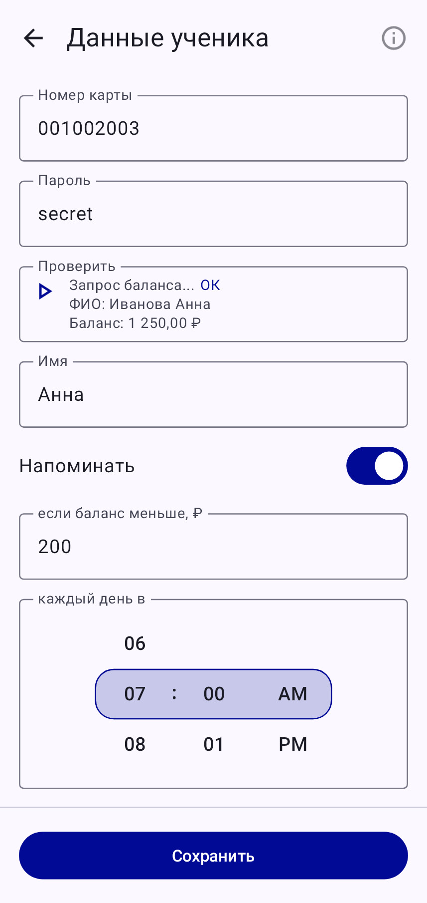

# ЛИнТех Питание

Android-приложение для отслеживания баланса школьного питания с помощью веб-сервиса https://school28-kirov.ru/informaciya-o-pitanii:
- позволяет проверять балансы нескольких учеников сразу
- автоматически проверяет баланс в указанное время (раз в сутки) и отображает уведомление в случае низкого баланса

 

## Отказ от ответственности

Приложение является независимой разработкой и не связано, не аффилировано и не одобрено ни школой № 28 г. Кирова и сервисом school28-kirov.ru, ни ПАО «Коммерческий банк „Хлынов“» и приложением «Хлынов Банк»; все упомянутые названия и товарные знаки принадлежат их правообладателям и используются только для идентификации соответствующих сервисов. 

Данные об учениках и балансах получаются парсингом стороннего веб-сервиса, поэтому их корректность, полнота и доступность не гарантируются.

Приложение предоставляется «как есть», без каких-либо гарантий, и автор не несёт ответственности за финансовые или иные последствия его использования. Установка и использование приложения осуществляются на свой страх и риск. 

Пароль ученика сохраняется локально в базе данных приложения в открытом виде — защита опирается только на Android-песочницу и отключённый облачный бэкап.

Приложение предназначено исключительно для личного использования родителями и опекунами; коммерческое распространение не предполагается.
